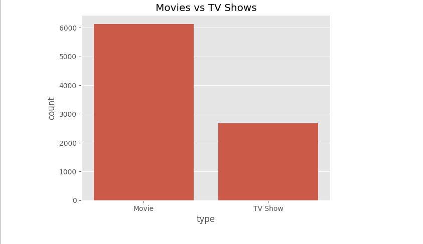
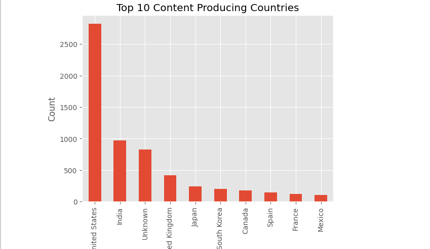
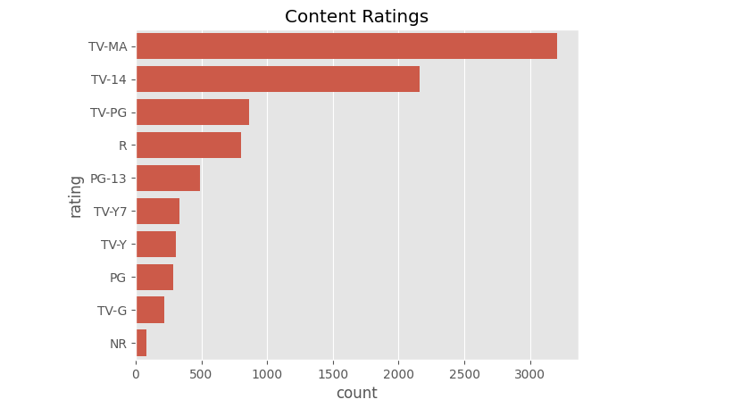
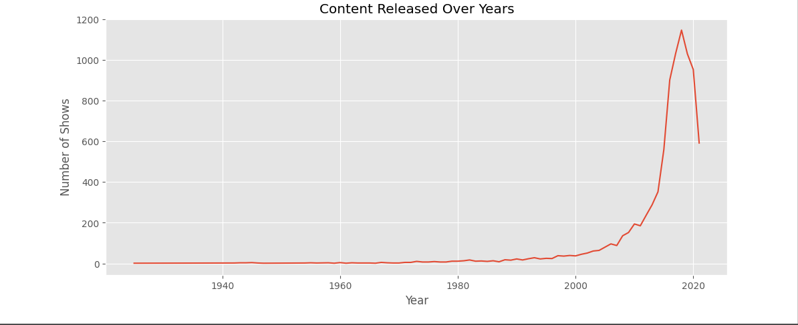
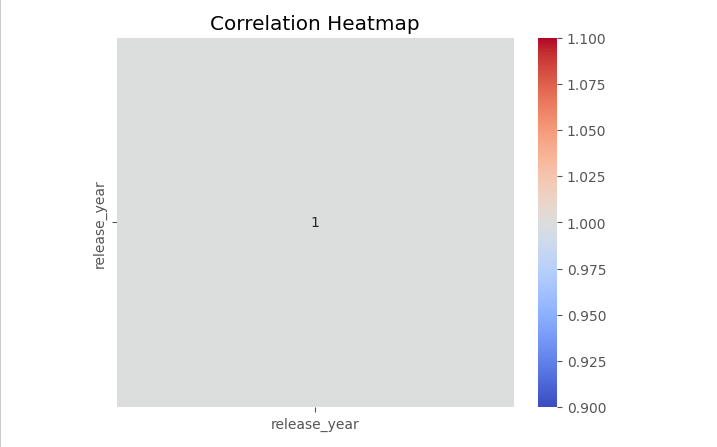

# Exploratory Data Analysis (EDA) Project

## Objective
The objective of this project is to perform Exploratory Data Analysis (EDA) on the Netflix dataset to uncover patterns, trends, correlations, and insights using statistical summaries and visualizations.

---

# Technologies Used

- Python
- Pandas
- NumPy
- Matplotlib
- Seaborn
- Jupyter Notebook

---

# Dataset

Netflix Movies and TV Shows Dataset

The dataset contains information about:
- Movies
- TV Shows
- Release Year
- Country
- Ratings
- Duration
- Directors
- Cast

---

# Project Workflow

## 1. Data Loading
Loaded the Netflix dataset using Pandas.

## 2. Data Exploration
Analyzed:
- Dataset shape
- Data types
- Missing values

## 3. Data Cleaning
Performed:
- Handling missing values
- Removing duplicate records

## 4. Statistical Summary
Generated statistical summaries to understand data distribution.

## 5. Data Visualization
Created visualizations to analyze:
- Movies vs TV Shows
- Top content producing countries
- Ratings distribution
- Release year trends
- Correlation heatmap

## 6. Pattern & Trend Analysis
Identified patterns and influencing factors in Netflix content.

---

# Key Visualizations

- Content Distribution Graph
- Top Countries Bar Chart
- Ratings Analysis
- Release Year Trend Graph
- Correlation Heatmap

---

# Key Insights

- Netflix contains more Movies than TV Shows.
- The United States produces the highest amount of Netflix content.
- Content production increased rapidly after 2015.
- TV-MA is one of the most common ratings on Netflix.
- Visual analysis helps uncover trends and user viewing patterns.

---

# Expected Outcome Achieved

This project helped in developing:
- Analytical thinking
- Data exploration skills
- Data visualization techniques
- Statistical analysis skills
- Storytelling with data

---

# Conclusion

This project successfully demonstrates Exploratory Data Analysis using the Netflix dataset. Various statistical summaries and visualizations were used to uncover meaningful trends and patterns. The project improved understanding of data analysis, visualization, and insight generation.

---

# Folder Structure

```text
Exploratory-Data-Analysis-Project/
│
├── netflix_titles.csv
├── exploratory_data_analysis.ipynb
├── README.md
└── images/
```

---

# Project Screenshots

## Content Distribution



---

## Top Countries Analysis



---

## Ratings Analysis



---

## Release Year Trends



---

## Correlation Heatmap


